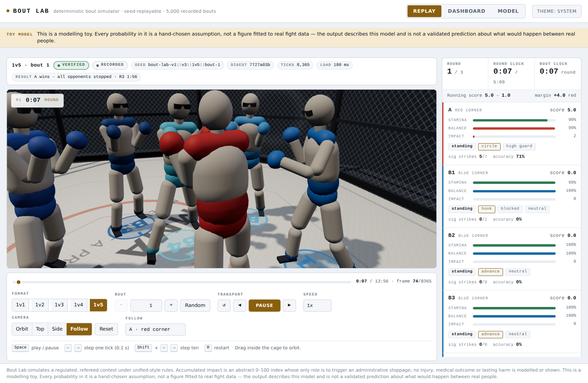
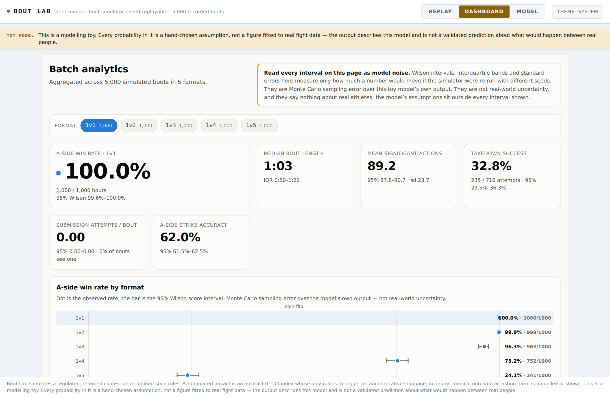
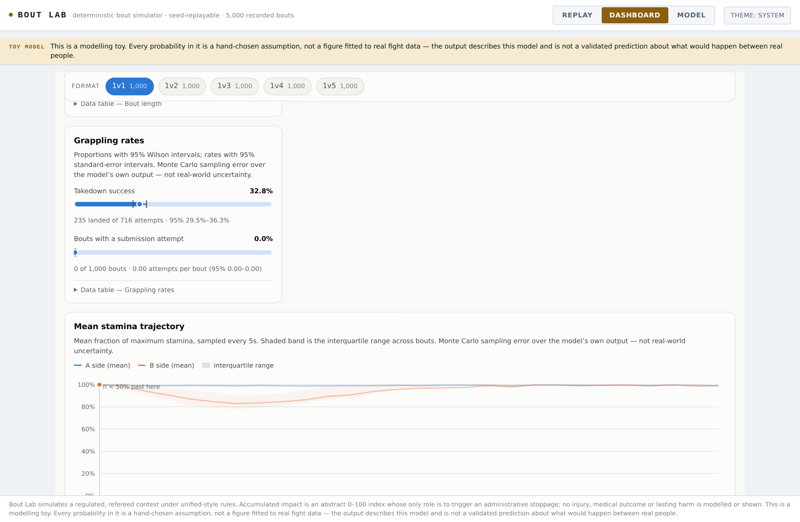

# Bout Lab

[](https://www.typescriptlang.org/)
[](https://threejs.org/)
[](https://react.dev/)
[](#tests)
[](LICENSE)
[](#read-this-before-you-read-anything-else)

A deterministic, fully replayable combat-sports **simulation toy** with a 3D
replay viewer and an analytics dashboard, built as a single self-contained web
page - 5,000 recorded bouts in 2.1 MB, with no network access of any kind. It simulates a regulated, refereed, unified-rules-style contest between
two hypothetical athlete profiles, including handicap exhibition formats from
one-on-one up to one-against-five.

Every bout is a pure function of a seed. Nothing is fetched, nothing is random
at page load, and any bout can be reproduced exactly, on any machine, from a
40-character string.

---

## Read this before you read anything else

> ### This is a model of a model. It is not a prediction about real people.
>
> - **Every probability, coefficient and threshold in this project is a
>   hand-chosen modelling assumption.** They live in one file,
>   [`src/engine/params.ts`](src/engine/params.ts), so you can read all of them
>   in one sitting and disagree with them individually.
> - **Nothing is fitted to real fight data.** No regression was run, no dataset
>   was consulted, no outcome was calibrated against any real athlete, event or
>   organisation. The numbers were chosen because they produce a bout that
>   behaves plausibly on screen, and for no other reason.
> - **The output describes this model, not the world.** When the dashboard says
>   "Athlete A wins 97.5% of 1v5 bouts", the honest reading of that sentence is
>   "under the assumptions hard-coded in `params.ts`, this state machine ends
>   with A standing 97.5% of the time". It is not a claim about what would
>   happen between two actual human beings, and it should not be used as one.
>   Change one constant and the number changes.
> - **The athlete profiles are hypothetical.** They are body metrics, three
>   one-rep-max lifts and a training history. None of those is a fighting
>   attribute; the translation from one to the other is spelled out in
>   [`src/engine/fighter.ts`](src/engine/fighter.ts) and every step of it is a
>   judgement call, annotated as such.
>
> ### No injury, gore or medical outcome is modelled or depicted.
>
> The model carries a single abstract scalar per fighter called the **damage
> index**. It is a bookkeeping quantity on a 0-130 scale whose *only* function
> is to trigger an **administrative referee stoppage** when it crosses a
> threshold. It does not represent a wound, a diagnosis, a medical state or any
> lasting harm, and nothing in the simulation or the renderer depicts one. The
> 3D viewer shows impacts as a brief abstract ring and a short camera shake; it
> has no blood, no injury, no ragdoll and no death state. A fighter who is
> stopped is faded out and seated at the cage edge, and the bout ends.
>
> The scope of the model is explicitly **regulated competition**: three rounds,
> a referee empowered to stop the contest at any moment, three judges, and a
> doctor present. It says nothing about unregulated violence and is not
> intended to.

---

## Screenshots

Everything below is the single self-contained page, running offline with no
network access of any kind.


*The replay viewer on a 1v1 bout - the provenance bar above, the HUD with both
fighters' bars, and the event log every frame of which is re-derived from the
seed.*


*The follow camera in a 1v5 handicap exhibition, with all six fighters tracked
separately in the HUD. How many opponents can reach the lone athlete at once is
emergent from where the bodies are, not a "numbers bonus" constant.*



*The top-down tactical camera, which is the clearest way to read spacing,
fan-out and who is actually within reach of whom.*



*Batch analytics across the full 5,000-bout corpus, with Wilson intervals on
every rate. The intervals describe sampling error inside the model only - they
say nothing about the width of the modelling choices, which is far larger.*



*Mean stamina over the course of a bout with interquartile bands, and the
sample-size strip underneath - bouts end at different times, so the chart states
how many are still contributing at each point rather than quietly thinning out.*


*The Model tab shows every derived attribute next to the exact arithmetic that
produced it, straight from the `derivationNotes` the engine records. Every step
is a judgement call and is displayed as one.*

---

## Quick start

```bash
npm install            # install dependencies (no network calls at runtime)

npm run dev            # development server on http://localhost:5173
npm run build          # type-check, then build to dist/
npm run build:single   # build, then inline everything into dist/standalone.html
npm run preview        # serve the production build on http://localhost:4173

npm test               # run the whole vitest suite once
npm run test:watch     # re-run tests on change
npm run verify         # re-execute replays and report verified/total
npm run generate       # regenerate the whole replay corpus (see "Scripts")
```

`dist/standalone.html` is a single file with all JavaScript, CSS and assets
inlined. It opens from a `file://` URL on a machine with no network connection.
`scripts/inline.mjs` audits its own output and exits non-zero if any reference
that would cause a network request survives.

### Reproducing a bout

Every bout in the application is identified by a **format** (the number of
opponents, 1-5) and an **index** (the bout number within that format). The seed
is built from those two numbers plus the master seed:

```ts
boutSeed(MASTER_SEED, opponents, index)
// -> "bout-lab-v1::v3::1v3::bout-42"
```

So bout 42 of the 1v3 format is the same bout in the browser, in the test
suite, and in a script - it is recomputed, never re-rolled:

```bash
# Dump every tick of that bout to exports/bout-1v3-42.json
npx tsx scripts/exportBout.ts 3 42

# Re-execute stored replays and a fresh sample; non-zero exit on any mismatch
npx tsx scripts/verify.ts --sample=5

# Aggregate statistics over a batch (N bouts per format)
N=200 npx tsx scripts/calibrate.ts
npx tsx scripts/smoke.ts
```

The master seed is read from `$MASTER_SEED`, else from
`src/data/replays.ts`, else from a built-in default.

---

## Project structure

```
mma-sim/
├── index.html                  Vite entry document
├── vite.config.ts              build + vitest configuration
├── docs/CONTRACT.md                 the frozen module contract (see below)
│
├── src/
│   ├── main.tsx                mounts <App/> into #root
│   │
│   ├── engine/                 the simulation - no DOM, no React, no I/O
│   │   ├── types.ts            FighterState, TickSnapshot, BoutEvent, BoutResult
│   │   ├── params.ts           EVERY modelling assumption, in one file
│   │   ├── fighter.ts          athlete profile -> derived attributes
│   │   ├── actions.ts          the action catalogue (durations in ticks)
│   │   ├── rng.ts              sfc32 seeded RNG + FNV-1a state digest
│   │   ├── engine.ts           the fixed-timestep state machine
│   │   └── recorder.ts         ReplayFile format, analytics, boutSeed()
│   │
│   ├── replay/
│   │   └── player.ts           loadReplay() + ReplayPlayer transport
│   │
│   ├── render/                 3D replay renderer (Three.js)
│   │   ├── index.ts            ArenaRenderer public surface
│   │   ├── arena.ts            octagonal cage, floor, lighting
│   │   ├── fighterRig.ts       one primitive humanoid rig per fighter
│   │   ├── cameras.ts          orbit / top / side / follow
│   │   └── renderer.ts         scene assembly and the per-frame update
│   │
│   ├── ui/                     React application shell
│   │   ├── App.tsx             Replay / Dashboard / Model tabs
│   │   ├── ReplayView.tsx      viewer + transport wiring
│   │   ├── Controls.tsx        format, bout, playback, camera controls
│   │   ├── Hud.tsx             round clock, bars, posture, live tallies
│   │   ├── Timeline.tsx        clickable BoutEvent list
│   │   ├── ModelNotes.tsx      derived attributes + the parameter table
│   │   ├── Dashboard.tsx       cross-bout aggregation
│   │   ├── charts.tsx          hand-written inline SVG charts
│   │   ├── styles.css
│   │   └── dashboard.css
│   │
│   ├── workers/                optional batch worker (the UI works without it)
│   └── data/
│       └── replays.ts          MASTER_SEED + REPLAY_INDEX (generated)
│
├── tests/
│   ├── rng.test.ts             generator reproducibility and distribution
│   ├── engine.test.ts          state-machine invariants
│   ├── determinism.test.ts     the replay guarantee (the important one)
│   └── analytics.test.ts       analytics vs the event log
│
├── scripts/
│   ├── generate.ts             batch-generate the corpus + src/data/replays.ts
│   ├── verify.ts               re-execute replays, report verified/total
│   ├── consistency.ts          grappling-pair invariant sweep
│   ├── exportBout.ts           full tick-by-tick dump of one bout
│   ├── inline.mjs              dist/index.html -> dist/standalone.html
│   ├── smoke.ts                quick sanity run
│   └── calibrate.ts            batch statistics per format
│
├── docs/
│   └── screenshots/            the images embedded under "Screenshots"
│
└── public/
    └── replays/                the generated corpus (see "Scripts")
        ├── index.json          run manifest
        ├── 1v<N>.summary.csv   one row per bout, including its digest
        ├── 1v<N>.analytics.jsonl.gz
        └── 1v<N>/bout-<i>.json full ReplayFiles with their event timelines
```

[`docs/CONTRACT.md`](docs/CONTRACT.md) is the **frozen module contract the implementation
was built against** - the agreed shape of every interface between the engine,
the replay layer, the renderer and the UI, written before the code and not
edited to match it afterwards. It is the reference for what each module is
allowed to assume about the others; if a change needs the contract to move, that
is worth saying out loud rather than editing in passing.

[`CONTRIBUTING.md`](CONTRIBUTING.md) covers setup, the determinism contract and
the rules that a change to this codebase has to respect.

---

## The simulation model

### 1. Time base and the tick loop

The simulation is a **fixed-timestep state machine**. One tick is
`dt = 0.1 s`; a round is 300 s (3,000 ticks); a bout is three rounds with 60 s
between them, so the longest possible bout is 10,200 ticks. There is no
variable timestep and no wall-clock dependency anywhere in the engine.

Every tick runs the same six phases in the same order. **This ordering is part
of the determinism contract** - changing it changes every bout ever recorded:

1. **Clock and round management.** Advance the tick, handle the between-rounds
   break, start a new round when the break ends.
2. **Per-fighter upkeep.** Stamina drain and regeneration, balance recovery,
   knockdown timers, engagement counts.
3. **Action advance and resolution**, iterating fighters in **ascending id**.
   Each fighter's current action ticks forward; if this is its `resolve` tick,
   the outcome is rolled; if it has run its full duration, a new action is
   chosen.
4. **Steering and integration.** Desired acceleration, drag, speed clamp,
   position integration, cage clamp, body separation.
5. **Referee checks.** Accumulated-impact stoppage, ground-strike stoppage,
   downed-fighter stoppage, stand-up for inactivity.
6. **Digest update.** Fold this tick's state into the running fingerprint.

Because every draw from the RNG happens inside this loop, in this order, the
whole bout is a deterministic function of the seed.

### 2. Actions

An action is a **timed commitment**, not an instantaneous event.
[`src/engine/actions.ts`](src/engine/actions.ts) gives each of the 23 actions a
`total` duration and a `resolve` tick, both in ticks:

| field | meaning |
| --- | --- |
| `total` | how many ticks the fighter is committed for |
| `resolve` | the tick on which the outcome is rolled |
| `stamina` | stamina spent at commitment |
| `baseDamage` | abstract impact index before power and variation |
| `range` / `minRange` | effective distance band, metres |
| `commitment` | balance cost to the attacker |

A `headKick` is `total: 7, resolve: 5` - 0.7 s of commitment with contact 0.5 s
in. The renderer reads the *same* numbers, so an animation's contact frame is
the exact frame the engine resolved on, and the 3D view cannot drift out of
sync with the event log.

Once committed, an action runs to completion. A fighter who commits to a
clinch break and is taken down mid-windup still finishes the break attempt.

**Choosing an action.** When an action ends, the fighter builds a weight list
appropriate to their posture (standing / clinch / ground-top / ground-bottom),
scaled by distance, fatigue, their derived attributes and a per-bout tendency
jitter. The weights are then raised to `1 / decisionNoise` - a softmax-style
temperature that sharpens or flattens the choice - and one is drawn. A
defensive posture (`neutral`, `highGuard`, `slip`, `parry`, `sprawl`, `frame`,
`subDefend`) is chosen at the same moment, gated by technique and fatigue.

Two modelling choices worth calling out, both assumptions:

- An untrained fighter throws proportionally **more wide, looping hooks** and
  **reaches for a grab far more often** than a trained one. Both are encoded as
  `(1 - strikingIndex)` terms in the weights.
- A fatigued or badly marked-up fighter weights `retreat` more heavily.
- Reaching for a clinch is gated hard by distance: the close-range factor is
  `1` inside 1.0 m, `0.3` out to 1.4 m and `0.02` beyond that, because you
  cannot grab someone you cannot touch. This single tendency turns out to
  dominate the multi-opponent results - see
  [the sensitivity caution](#what-the-model-actually-outputs).

### 3. Resolving a strike

Every strike resolution is a **logit sum passed through a sigmoid**. Starting
from `logit(strikeBaseHit)`, the model adds:

| term | driven by |
| --- | --- |
| `strikeSkillGain x (attacker - defender) strikingIndex` | training history |
| `strikeTechniqueGain x (attacker - defender) techniqueIndex` | timing, feints, ring craft |
| `strikeFatigueLogit x attacker fatigue` | the attacker slows down |
| `defenceFatigueLogit x defender fatigue` | the defender slows down more |
| `ln(form)` | that fighter's per-bout "day form" |
| `focusPenaltyLogit x (engagedBy - 1)` | splitting attention between attackers |
| `+1.6` if the defender is down, `+0.9` if grounded underneath, `+0.5` if off balance | positional |
| `blockLogit` / `evadeLogit`, **scaled by `1 / sqrt(engagedBy)`** | the defender's chosen defensive posture, and how much of the threat it can actually cover |

Distance is checked first: a strike thrown outside `range + 0.12 m` simply
comes up short and is recorded as a miss.

**Defence does not switch off when you are outnumbered - it stops covering
everything.** A guard or an evasion is oriented at one attacker, so its logit
value is divided by `sqrt(engagedBy)`: against two attackers a high guard is
worth about 71% of its value, against four about half. That is a separate
mechanism from `focusPenaltyLogit`, which is a flat penalty for split
attention; both are assumptions.

On a hit, the damage index applied is
`baseDamage x powerIndex x damagePowerScale x lognormal(damageVariation) x flush x (1 - 0.3 x fatigue)`.
It reduces the defender's balance and stamina as well. A single strike above
`knockdownThreshold` rolls for a **knockdown** - an administrative state in
which the fighter is prone and recovering for 1.2-3.4 s, more likely when they
are already fatigued.

**The placement lottery (`flush`).** `flushChance` of landed strikes - 5% -
connect flush, and are multiplied by a factor drawn uniformly from
`0.8 x flushMultiplier` to `1.5 x flushMultiplier`, i.e. 1.8x to 3.4x. This is
the model's **puncher's chance**: it is the mechanism by which a much weaker
fighter can occasionally end a bout outright rather than only by accumulation.
It is available to **both sides on identical terms** - there is no skill,
strength or mass term in the roll - so it is a pure placement lottery, and it
is one of the larger single assumptions in the file.

On a miss, the outcome is recorded as `blocked`, `evaded` or `missed` depending
on what the defender was doing; a blocked strike passes a small fraction of its
impact through (`damageBlockedFraction`).

### 4. Grappling

Clinch entry, takedowns, guard passes, sweeps, stand-ups and submissions all use
the same logit structure, weighted by **relative strength**, **log mass ratio**,
**grappling index**, **technique index** and fatigue. Ground position advances
along a fixed ladder `guard -> half -> side -> mount` (with `back` reachable as
a submission-favourable position). A submission accumulates `subProgress` per
attempt against the defender's resistance and finishes at 1.0.

With the supplied profiles neither athlete has any grappling training, so
`grapplingIndex` is 0 on both sides and every grappling exchange is decided by
strength, mass and general technique. **That is a consequence of the inputs,
not a rule** - give either profile grappling years and the ground game changes.

#### The engagement invariant

Grappling is the one place where a fighter's state is not private: being on top
only means something if somebody is underneath. The engine therefore maintains
a hard invariant, which the renderer and the analytics layer may rely on:

> In every frame: the grounded fighters decompose exactly into `top`/`bottom`
> pairs (equal counts, each with a single partner recorded in
> `groundOpponent`); the number of fighters in the clinch is even; and
> `groundRole` / `groundPosition` are `'none'` on everyone who is not on the
> floor.

Consumers may therefore read `groundRole` directly: a fighter drawn on top
always has a partner underneath.

Three mechanisms enforce it, and they matter because this is easy to get wrong
in a handicap format where a third fighter can always walk into an exchange:

1. **One teardown path.** Every place that ends a grapple or a clinch -
   `exitGround`, `stopFighter`, the knockdown path, `startRound` and the
   end-of-round break - routes through a single `clearEngagement(f)`, which
   clears `posture`, `groundRole`, `groundPosition`, `groundOpponent`,
   `subProgress` and the stall counters together. There is no second way to
   half-release a fighter.
2. **Entry frees both sides first.** `enterGround` clears any engagement either
   fighter was already in **including the third party on the other end of it**,
   so a second attacker taking someone down cannot orphan the first.
3. **Preconditions are re-checked on the resolution tick.** Because an action is
   a multi-tick commitment, the world can change under it: `actionStillValid(f, d)`
   re-tests each action's preconditions at the moment it resolves, so an
   in-flight `breakClinch`, `shoot`, `passGuard`, `sweep`, `standUp` or
   `submission` **aborts as a miss** rather than resolving into a state it no
   longer belongs to. A clinch break committed one tick before the opponent
   completes a takedown now simply fails, which is both correct bookkeeping and
   the more plausible outcome.

`scripts/consistency.ts` sweeps the invariant across 60 bouts x 5 formats and
exits non-zero on any violation. Current status: **0 violations in 892,126
frames**. `tests/engine.test.ts` asserts the same invariant as ordinary
regression tests.

### 5. The referee

The referee is a separate pass, checked every tick:

- **Accumulated impact.** When a fighter's damage index reaches their
  `durability`, the contest is stopped.
- **Unanswered ground strikes.** `groundedStrikeStopCount` consecutive
  unanswered strikes from top position stops it.
- **Downed and covering up.** A fighter who is down, heavily marked and still
  being hit is waved out.
- **Inactivity.** A stalled top position is stood back up after
  `standUpAfterStalledSeconds` of genuine inactivity. "Stalled" is tracked by a
  `groundStallTicks` counter that any landed ground strike, position
  improvement or submission work resets on both fighters.

> **A modelling caution, kept here because it is instructive.** That stand-up
> rule previously compared `tick - lastStruckTick` against the threshold. Since
> `lastStruckTick` initialises to `-999`, the difference exceeded the threshold
> from tick 1, so the referee stood fighters up almost immediately after every
> takedown and **ground exchanges could effectively not happen at all** - the
> ground game was silently absent from every published statistic. A one-line
> initialisation detail in a referee heuristic removed an entire phase of the
> sport from the model, and it did so without producing a crash, an invariant
> violation or an obviously wrong-looking bout. It is worth assuming there are
> others like it that have not been found yet.

In a handicap format, a stopped opponent is removed from the contest and the
remaining opponents continue. The bout ends when Athlete A is stopped or when
every opponent has been.

### 6. Scoring

Three judges score each round 10-9 on the accumulated margin (significant
strikes, takedowns, control time, submission attempts), each with independent
Gaussian noise of `judgeNoise` on the margin. That produces unanimous, split and
majority decisions and draws without any special-casing.

### 7. From athlete profile to model parameters

A profile supplies body metrics, three one-rep-max lifts, training history and a
conditioning label. **None of those is a fighting attribute**, so each is
translated explicitly, and the translation is recorded in a `derivationNotes`
string array that the Model tab displays verbatim.

The four deliberate choices:

1. **Lifting strength is never a direct proxy for fighting ability.** It enters
   only as *relative* strength (total / bodyweight), on a log scale, and only
   feeds the power index and the grappling terms. Absolute load is discarded.
2. **Experience saturates.** `1 - e^(-years/tau)`. The fifth year of training is
   worth far less than the first.
3. **Taekwondo is discounted to 0.6 of a boxing year** for this ruleset -
   kicking, distance and timing transfer; gloved hand-fighting and head movement
   largely do not. That 0.6 is a judgement call, not a measurement.
4. **Conditioning changes stamina economy only.** It never adds capability.

Running the supplied profiles through `deriveAttributes` gives:

| derived attribute | Athlete A | Athlete B | how |
| --- | --- | --- | --- |
| mass | 90.7 kg | 68.0 kg | 200 lb / 150 lb |
| height, reach | 1.78 m, 0.91 m | 1.78 m, 0.91 m | reach is derived from height alone, so it is **identical** and confers nothing |
| `massIndex` | 0.288 | 0.001 | `ln(mass / 68 kg)` |
| relative strength | 5.25x BW | 3.00x BW | (bench + squat + deadlift) / bodyweight |
| `strengthIndex` | 0.560 | 0.000 | `ln(relStrength / 3.0)` |
| `strikingIndex` | 0.777 | 0.000 | 3 boxing yr x 1.0 + 5 TKD yr x 0.6, saturated at tau = 4 |
| `grapplingIndex` | 0.000 | 0.000 | neither profile lists grappling training |
| `techniqueIndex` | 1.000 | 0.000 | 8 training years, saturated at tau = 3, plus a frequency bonus |
| `powerIndex` | 1.689 | 0.700 | `exp(0.75 x massIndex + 0.55 x strengthIndex) x (0.70 + 0.30 x techniqueIndex)` - technique gates how much force reaches a moving target |
| `speed` | 1.92 m/s | 1.70 m/s | `baseSpeed + speedSkillBonus x technique - speedMassPenalty x massIndex` |
| stamina pool / regen | 109 / 2.71 per s | 100 / 2.13 per s | conditioning 0.80 vs 0.50 |
| `durability` | 128 | 110 | `tkoDamage x (0.55 + 0.55 x exp(massIndex))` |

The gap between these two columns is the entire story of the model's output.
It exists because of the numbers in the profiles and the four translation rules
above - not because anything was tuned to produce a particular result.

How big that gap is depends on constants that are easy to skim past. The
technique gate on power, `0.70 + 0.30 x techniqueIndex`, decides that an
untrained fighter still delivers 70% of their raw force - lower that floor and
the gap widens sharply. As written, A ends up with **2.4x** the power index and
**1.13x** the top speed, not the much larger ratios a different reading of the
same profiles would give. Neither constant is measured; both were chosen.

### 8. One-vs-N geometry

The handicap formats add **almost no new parameters**. There is deliberately no
"numbers bonus" constant. How many opponents can act on the lone fighter at once
is an emergent property of where the bodies are and how long each fighter's
reach is. The group starts fanned out around the target
(`teamSpreadRadians`), teammates softly repel each other so they do not stack,
and everything else follows from the ordinary distance checks that every action
already performs.

Only three extra assumptions are made explicit:

- `swarmStaminaPenalty` (1.1) - extra stamina drain per additional engaged
  opponent.
- `focusPenaltyLogit` (1.05) - defensive logit lost per additional engaged
  opponent, for split attention.
- **Defensive cover scales as `1 / sqrt(engagedBy)`** - a guard is pointed at
  one person, so being outnumbered does not stop you defending, it stops the
  defence covering everything.

All three apply to whoever is outnumbered at that instant, in either direction:
if Athlete A drops three opponents and faces the last one alone, the surviving
opponent is the one paying the penalties.

### What the model actually outputs

For the record, and with every caveat above still in force - the shipped
corpus, **1,000 bouts per format**, master seed `bout-lab-v1`, params hash
`47a2bb37`:

| format | A wins | method breakdown |
| --- | --- | --- |
| 1v1 | **1000 / 1000 (100.0%)** | referee stoppage (strikes) 835, ground strikes 165 |
| 1v2 | **999 / 1000 (99.9%)** | all opponents stopped 999, ground strikes 1 |
| 1v3 | **963 / 1000 (96.3%)** | all opponents stopped 955, ground strikes 35, decision 8, strikes 2 |
| 1v4 | **752 / 1000 (75.2%)** | all opponents stopped 696, strikes 178, ground strikes 70, decision 56 |
| 1v5 | **241 / 1000 (24.1%)** | strikes 638, all opponents stopped 214, ground strikes 121, decision 27 |

Read this table as a description of `src/engine/params.ts`, not of reality. Every
one of those numbers is downstream of constants that were chosen by hand.

#### The sensitivity caution - the most important caveat in this project

The multi-opponent numbers are **not robust**. They are dominated by assumptions
about *how untrained fighters choose actions*, not by anything physical.

The concrete demonstration: the clinch-entry close-range factor described in
[Actions](#2-actions) used to stay high out to 1.8 m, which had untrained
fighters reaching for a grab from well outside grabbing range. Tightening it to
`1 / 0.3 / 0.02` at 1.0 m / 1.4 m - **one behavioural tendency, with nothing
changed about strength, mass, conditioning, reach or any striking parameter** -
moved the 1v5 A-win rate from **77% to 24%**.

A single judgement call about when a person reaches for a grab was worth more
than fifty percentage points at 1v5. Nothing selected between the two versions
except which looked more plausible on screen. So:

- Treat the 1v4 and 1v5 rows as **illustrative of the model's dynamics, not as
  estimates of anything**. Their error bars are not the binomial ones you could
  compute from 1,000 bouts; they are the width of the modelling choices, which
  is far larger and cannot be quantified from inside the model.
- The 1v1 row is the most stable, and it is still only a statement about these
  two hypothetical profiles under these assumptions.
- If you change a parameter and the answer moves a lot, that is information
  about the model's fragility, not a discovery about fighting.

---

## Every parameter group

All of these live in [`src/engine/params.ts`](src/engine/params.ts), documented
field by field. The Model tab renders the same table in the browser.

| group | what it controls | representative fields |
| --- | --- | --- |
| **Time base** | the discrete clock | `dt` 0.1 s, `rounds` 3, `roundSeconds` 300, `breakSeconds` 60 |
| **Arena** | the cage | `cageRadius` 4.6 m |
| **Attribute derivation** | profile -> attributes | `refBodyMassKg`, `refRelStrength`, `tkdTransfer` 0.6, `boxTransfer` 1.0, `tauStriking/Grappling/Technical`, `strengthWeight`, `massPowerWeight` |
| **Movement physics** | how bodies move | `baseSpeed` 1.7, `speedSkillBonus` 0.45, `speedMassPenalty`, `accel`, `drag`, `staminaSpeedFactor` |
| **Stamina** | the energy economy | `staminaMax`, regen at rest and by conditioning, drains for movement / clinch / ground top / ground bottom / damage taken, `breakRecovery` |
| **Balance** | being off-balance | `balanceMax`, `balanceRegen` |
| **Striking** | whether a strike lands | `strikeBaseHit` 0.33, `strikeSkillGain` 1.35, `strikeTechniqueGain` 0.80, `blockLogit`, `evadeLogit` (both scaled by `1/sqrt(engagedBy)`), `strikeFatigueLogit`, `defenceFatigueLogit` |
| **Damage** | the abstract impact index | `damagePowerScale` 0.34, `damageVariation` 0.50, `damageBlockedFraction`, **`flushChance` 0.05**, **`flushMultiplier` 2.3**, `knockdownThreshold` 5.2, `knockdownChance`, `tkoDamage`, `damageRecoveryPerRound` |
| **Grappling** | clinch and ground | `takedownBaseChance` and its strength / mass / skill gains, `sprawlLogit`, `clinchBaseChance` 0.58, `passBase`, `sweepBase`, `standUpBase`, `subProgressBase`, `subEscapeBase` |
| **Referee** | when it gets stopped | `refCheckSeconds`, `groundedStrikeStopCount`, `standUpAfterStalledSeconds` (against a stall counter reset by any real ground activity) |
| **Scoring** | the judges | `scoreSigStrike`, `scoreTakedown`, `scoreControlPerSecond`, `scoreSubAttempt`, `judgeNoise` |
| **Stochastic variation** | why two bouts differ | `formSd` (per-bout day form), `tendencySd` (per-bout style jitter), `decisionNoise` (action-selection temperature) |
| **1-vs-N** | the handicap format | `teamSpreadRadians`, `swarmStaminaPenalty` 1.1, `focusPenaltyLogit` 1.05 |

Changing any of these changes the `paramsHash` stored in every replay file, so
a replay recorded under one parameter set cannot silently be replayed under
another.

---

## Replay files: seed + events + digest

### What is stored

```ts
interface ReplayFile {
  format: number;            // replay format version
  seed: string;              // everything needed to reproduce the bout
  opponents: number;
  paramsHash: string;        // fingerprint of the parameter set used
  paramOverrides?: Partial<Params>;   // only if non-default params were used
  profiles: { a: AthleteProfile; b: AthleteProfile };
  digest: string;            // fingerprint of the entire per-tick state stream
  ticks: number;
  result: BoutResult;
  events: BoutEvent[];       // the complete discrete timeline
  analytics: BoutAnalytics;  // precomputed summary for the dashboard
}
```

What is **not** stored: the frames. Bout 42 of the 1v3 format is 2,608 frames x
4 fighters x 20 fields. Written out as poses that is **3.33 MB**; as seed +
events + digest it is **59.9 KB**, about **57x smaller**. That ratio is what
makes it possible to ship a thousand bouts per format inside one HTML file.

The browser bundle squeezes it further still. `src/data/replays.ts` stores all
5,000 bouts in a **compact columnar encoding** that is expanded at module load,
and drops two things on purpose: the **event timeline**, because the player
re-executes the seed and re-derives a byte-identical one, and **trajectories
beyond the first 120 bouts per format** (the ones it does keep hold the engine's
native 5-second sampling at reduced precision, and the charts that use them say so and
report their own sample size). Every row still carries its digest, so any bout
in the bundle can be reconstructed and verified. That encoding is what keeps
the single-file build at **2.1 MB** for 5,000 bouts.

### Why that is a complete replay, not just a result

Three properties together:

1. **The engine is a pure function of `(seed, params, profiles)`.** It reads no
   clock, no environment, no global state, and takes every random draw from one
   seeded `sfc32` generator in a fixed order. Re-running it reproduces every
   intermediate state, tick for tick. `loadReplay()` does exactly that and hands
   back the full `TickSnapshot[]`.
2. **The complete event timeline is in the file.** Every strike, block,
   evasion, miss, takedown, position change, submission attempt, knockdown,
   stand-up, stoppage and decision, with its tick, round, actor, target, result
   and value. The timeline is inspectable without running anything.
3. **The digest proves the re-execution was the right one.** As the bout runs,
   the engine folds each tick's state into a rolling FNV-1a fingerprint. On
   load, the player re-executes and compares fingerprints. If a re-execution
   produced even a slightly different state sequence, the digest would not
   match, `verified` would be `false`, and the UI says so in a badge rather
   than quietly showing a different bout.

The fingerprint is quantised to three decimal places, so floating-point noise
below the recorded precision cannot flip it, while a 1 mm change in position
does.

Use `scripts/exportBout.ts` when you actually want the frames - it writes the
full tick-by-tick dump for a single bout, and prints both sizes so the trade-off
is visible.

### Verification as a CI gate

```bash
npx tsx scripts/verify.ts             # stored replays + a regenerated sample
npx tsx scripts/verify.ts --sample=10 --formats=1,5
```

It re-executes every replay in `public/replays/*.json` plus a fresh sample for
each format, compares digest, frame count, event count and result, prints
`verified N/M`, and exits non-zero if a single one fails.

---

## The 3D architecture

The renderer is plain **Three.js** with no scene-graph framework and no imports
from `three/examples`, so the single-file build has nothing to resolve at
runtime. Orbit control is about forty lines of pointer-drag maths written
directly against the container element.

```
ArenaRenderer
├── arena.ts      octagonal cage (radius 4.6 m), fence posts, canvas floor,
│                 centre mark, lighting tuned to read in light and dark themes
├── fighterRig.ts one humanoid per fighter, built from primitives only -
│                 head, torso, hips, upper/lower arms, upper/lower legs, gloves.
│                 Torso and limb radii scale with mass, so Athlete A is visibly
│                 heavier. Corner colours per team, numbered when N > 1.
├── cameras.ts    orbit / top / side / follow, plus reset
└── renderer.ts   per-frame update
```

The render loop is driven by `ReplayPlayer.advance(dt)`, which returns an
interpolation **alpha** between the current frame and the next one. The
renderer receives `(frame, next, alpha)` and interpolates, so playback is smooth
at 0.25x and still frame-accurate at 8x. **The engine's tick rate and the
display's frame rate are completely decoupled** - the simulation is never
re-run to draw.

Poses are driven entirely from state, never from a timeline:

- stance bounce while standing; guard height from `defense`
- arm and leg extension driven by `actionPhase`, with the contact frame placed
  at `ACTIONS[kind].resolve / total` - the same numbers the engine resolved on
- crouch and lean for `shoot`; knees drawn in for `clinchKnee`
- both bodies horizontal with correct top/bottom stacking on the ground, with
  `guard`, `half`, `side`, `mount` and `back` visually distinct
- prone with slow recovery for `down`; a still, seated pose at the cage edge,
  faded to 40% opacity, for `out`

Impacts are an abstract ring/flash marker and a short camera shake. There is no
blood, no injury depiction, no ragdoll and no death state.

---

## Tests

```bash
npm test
```

128 tests across four suites, all seeded, so a failure is always reproducible
and never flaky.

| suite | what it proves |
| --- | --- |
| **`tests/rng.test.ts`** (36) | The generator is a pure function of its seed; interleaving two instances changes nothing; neighbouring low-entropy seeds decorrelate; forked child streams are reproducible, distinct and uncorrelated (\|r\| < 0.02); the stream is uniform (chi-square over 10 deciles below the 0.1% critical value, variance 1/12); `normal()` is standard normal at 68/95/99.7 and always consumes exactly two draws; `weighted()` respects, and never picks, zero or negative weights; the digest is deterministic, order-sensitive, length-sensitive, reacts to a 0.001 change and ignores anything smaller. |
| **`tests/engine.test.ts`** (35) | Over 30 recorded bouts spanning 1v1 to 1v5: every bout terminates inside the maximum possible tick count with exactly one result and one `boutEnd`; the round counter and clock never rewind; stamina stays in `[0, staminaMax]` and balance in `[0, balanceMax]`; the damage index never falls inside a round; strike tallies never decrement and landed never exceeds attempted; a fighter waved out is never reinstated; nobody leaves the cage or occupies another fighter's position; no action, defence, posture, ground role or result outside its enum, with a check that the corpus actually exercises at least 12 distinct actions; every event lands on a tick that exists, in order, addressed to a fighter that exists; each round opens exactly once; **the grappling-pair invariant holds - ground roles decompose into top/bottom pairs, clinches are pairwise, and `groundRole`/`groundPosition` are cleared on anyone not on the floor**; `runToEnd` and `runRecorded` consume the RNG identically. |
| **`tests/determinism.test.ts`** (25) | The load-bearing suite. Re-recording a seed gives a byte-identical replay file including analytics; recording other bouts in between changes nothing; a `JSON.parse(JSON.stringify(...))` round trip still loads with `verified === true` for every format, reconstructs exactly `ticks + 1` frames, and reproduces every event object identically to the stored one; loading the same replay three times gives identical frames field by field; 24 different seeds give 24 distinct digests **and** 12 distinct full state streams; different seeds diverge within the first simulated second; and - so that none of the above is vacuous - tampering with the digest, the seed, the opponent count, a parameter override or an athlete profile each flips `verified` to `false`. Frame comparison uses an independent fingerprint over *every* field of every frame, which is deliberately wider than the engine's own digest (that one only covers position, stamina, damage, balance and landed count). |
| **`tests/analytics.test.ts`** (32) | Over 40 recorded bouts: every count in the analytics block is re-derived from the event log and must match - significant actions, landed/missed/blocked/evaded (which must partition the total exactly), takedowns attempted and landed, submission attempts, knockdowns, position changes; each landed strike and successful takedown is attributed to the fighter who threw it; committed attempts are an upper bound on resolved ones, with the reason stated; accuracy is exactly `landed/attempted` to three places; the per-fighter rows match the final frame of the replay; trajectories share sample points, start at full stamina and zero damage, and only fall by the between-round recovery; posture time never exceeds elapsed time. |

### The invariant sweep

Beyond the unit suites, `scripts/consistency.ts` re-checks the grappling-pair
invariant exhaustively - 60 bouts across all five formats, every frame, every
fighter - and exits non-zero on the first violation:

```bash
npx tsx scripts/consistency.ts
# grappling-pair invariant: 0 violations in 892126 frames
```

This existed because the invariant was previously **broken**: grappling state was
a set of per-fighter flags with no mutual-agreement check, so a third opponent
walking into an exchange could leave a fighter flagged "on top" with nobody
underneath, and an in-flight clinch break resolving after a takedown could leave
stale ground flags in place for thousands of frames. It was found by the test
suite rather than by looking at the screen, because it never crashed and rarely
looked wrong. The fix is described under
[The engagement invariant](#the-engagement-invariant); the tests that recorded
the defect are now ordinary passing regression tests.

### Verified in a browser

The single-file build was rendered headlessly at 1500x1000 with WebGL enabled.
The Replay, Dashboard and Model tabs all render, the 3D scene draws, and the
page produces **zero console errors** and makes **zero network requests** -
which is the behaviour `scripts/inline.mjs` audits for statically, confirmed at
runtime.

---

## Scripts

| script | usage |
| --- | --- |
| `scripts/generate.ts` | `npm run generate` - see below. |
| `scripts/consistency.ts` | `npx tsx scripts/consistency.ts` - sweeps the grappling-pair invariant over 60 bouts x 5 formats and exits non-zero on the first violation. |
| `scripts/verify.ts` | `npx tsx scripts/verify.ts [--sample=N] [--formats=1,2,3] [--quiet]` - re-executes stored and regenerated replays; exits non-zero on any mismatch. |
| `scripts/exportBout.ts` | `npx tsx scripts/exportBout.ts <opponents> <index>` - writes `exports/bout-1v<N>-<index>.json` with every frame, plus the events, analytics and metadata. Prints the file size and the ratio against the shipped replay. Refuses to write if the bout does not verify. |
| `scripts/inline.mjs` | `node scripts/inline.mjs [distDir]` - inlines every local script, stylesheet and asset from `dist/index.html` into `dist/standalone.html`, drops preload hints, then re-reads its own output and fails non-zero if any script, link, image, media, CSS `url()`, `@import` or sibling-chunk `import` would still hit the network. Node 22, ESM, no dependencies outside `node:` builtins. |
| `scripts/smoke.ts` | Quick sanity run with a sample timeline. |
| `scripts/calibrate.ts` | `N=200 npx tsx scripts/calibrate.ts` - batch statistics per format. |

### Generating the corpus

```bash
npm run generate                                   # 1000 bouts x 5 formats
npx tsx scripts/generate.ts --bouts 200 --formats 1,5
npx tsx scripts/generate.ts --full                 # also every full replay
```

`scripts/generate.ts` runs every bout for every format and writes:

| output | contents |
| --- | --- |
| `public/replays/index.json` | run manifest - master seed, replay format, params hash, bouts per format, and per-format aggregates (win counts and the method breakdown). Carries the model disclaimer inline. |
| `public/replays/1v<N>.summary.csv` | one row per bout: winner, method, round, time, counts **and its digest**, so any row can be re-derived and checked. |
| `public/replays/1v<N>.analytics.jsonl.gz` | the complete `BoutAnalytics` for all 1,000 bouts, trajectories included (~160 KB gzipped per format). |
| `public/replays/1v<N>/bout-<i>.json` | the complete `ReplayFile` **including the full event timeline**, for the first `--events` bouts of each format (the shipped corpus was generated with 50 per format; the flag's own default is 100). |
| `public/replays/1v<N>.replays.jsonl.gz` | **only with `--full`** - the complete `ReplayFile` for all 1,000 bouts of every format. Roughly 600 MB uncompressed and several minutes to produce. |
| `src/data/replays.ts` | regenerated: the columnar bundle the browser loads, described under [Replay files](#replay-files-seed--events--digest). |

Useful flags: `--seed <s>`, `--bouts <n>`, `--formats <list>`, `--events <n>`
(full replay files per format), `--traj <n>` (bouts whose trajectories are
bundled), `--full`.

The corpus is a **convenience, not the source of truth** - every bout in it is
reproducible from its seed alone, which is exactly what `npm run verify`
re-derives.

---

## Design constraints

- **No network at runtime.** No CDN imports, no web fonts, no telemetry, no
  external assets. The standalone build is audited for this and the audit fails
  the build if it is violated.
- **The engine has no DOM and no React.** It runs identically in Node and in the
  browser, which is what lets the test suite check the same code the page runs.
- **One file holds every assumption.** If you want to argue with the model,
  argue with `src/engine/params.ts`.

---

## Licence and intent

This is a modelling toy and a rendering exercise. It is not a prediction about
any real person, it is not fitted to any real data, and it must not be presented
as either.

---

## License

Released under the MIT License. See [`LICENSE`](LICENSE) for the full text.

The licence covers the code. It does not turn any number this project produces
into a claim about the world: the output describes
[`src/engine/params.ts`](src/engine/params.ts), and the conditions above on how
it may be presented are asked for on their own terms, not as a licence
condition.

